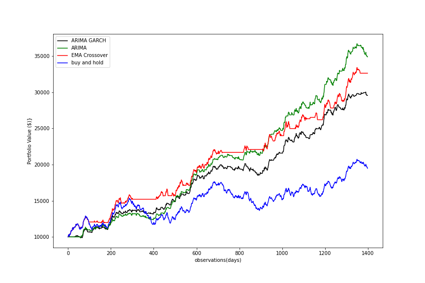

# multi-strategy-trading-algo
Implementing and comparing the performance of three trading algorithms.

In this report I've used a synthetic dataset to evaluate the performance of three different trading strategies:
- Trend following based on EMA crossover;
- Mean reversion based on ARIMA model;
- Mean reversion based on ARIMA-GARCH model.

Mean reversion based on ARIMA strategy considerably outperforms the other strategies in the train set. However, the EMA crossover strategy performs
better on the test set. The cumulative performance of different trading strategies is summarised in the figure below:

We also observe that after accounting for multiple testing in the train set, all four
trading strategies have a non-zero Sharpe ratio, which is significant at a confidence
level of 5%. While in the test set, the only statistically significant non-zero Sharpe
Ratio is the one generated by the EMA crossover strategy.

Overall, we conclude that one could expect a statically significant higher level of
excess returns per unit of risk under the EMA crossover strategy compared to the other
strategies reviewed in this report. This is because EMA crossover strategy is more
effective in capturing the upward trending behaviour displayed by our generated price
time series.

## This repo contains:
- pdf report summarising the methodology and key findings;
- Jupyter notebook with the analysis.
